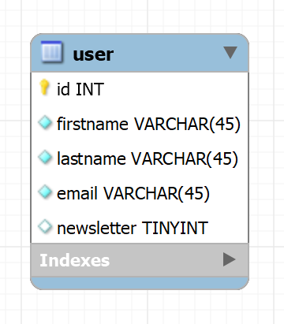
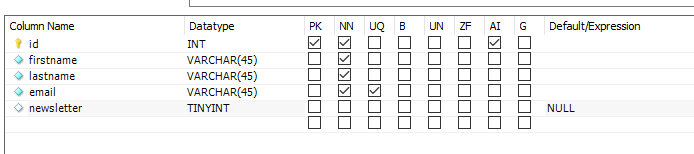

# test ADIMEO Titan
Le projet est une single page d'inscription pour faire parti des premiers touriste de Titan avec un formulaire où l'utilisateur doit renseigner son Nom, Prénom, adresse mail et dois renseigner si il veut être inscrit a la newsletter.

## Stack
Validation du formulaire en PHP, base de donnée en MySQL, HTML et CSS.

## Prérequis
Avoir PHP et MySQL installés sur sa machine. Créer sa BDD. Cloné le Projet

### Base de donnée
Créez une base de donné du nom de votre choix et un compte utilisateur avec un mot de passe de votre choix.

Dans cette base de donné, créez une table avec les champs suivant:
id -> de type INT , Primary Key, Auto increment et Non Nul
firstname -> de type VARCHAR , Non Nul
lastname -> de type VARCHAR , Non Nul
email -> type VARCHAR , Non Nul
newsletter -> type BOULEAN

### Configuration
Une fois le projet cloné, accédez au projet (cd nom_projet), ouvrez le ficher inscription_post.php et remplacez à la ligne 7 les termes DB_NAME, DB_USER et DB_PASSWORD par le nom de votre BDD, le nom d'utilisateur et le mot de passe respectif que vous avez créé à l'étape précédente pour la BDD.

# Test
Pour lancer le projet, sur votre terminal accédez à la racine du projet et tapez la commande 'php -S localhost:4000' puis sur votre navigateur (exemple Chrome) taper 'localhost:4000' dans la bare d'URL.
